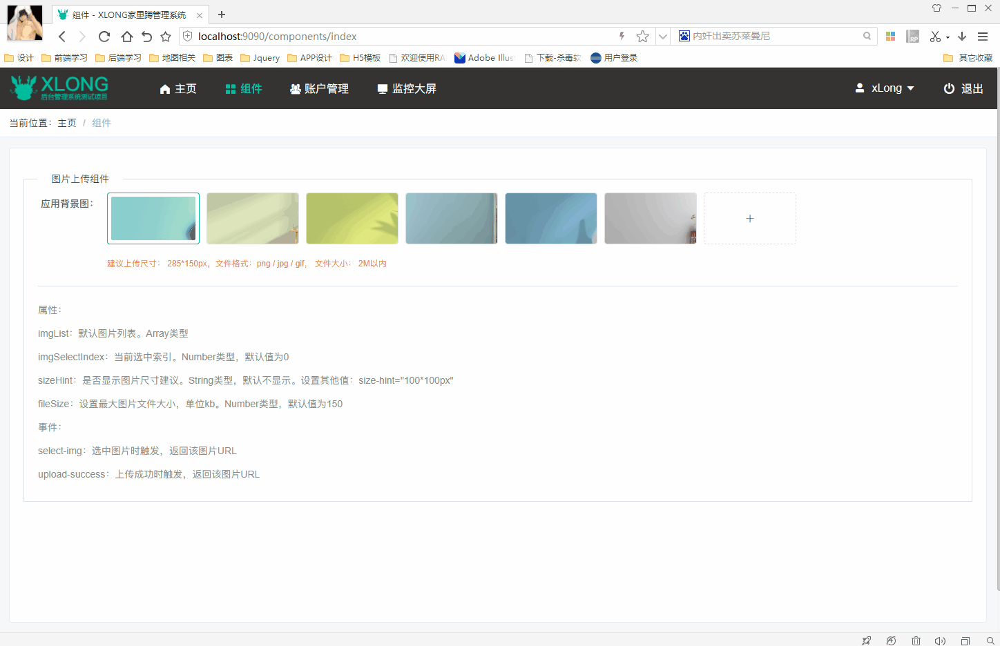
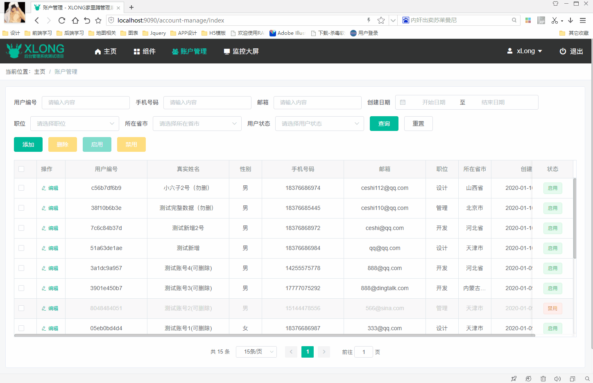

# xlong-admin-element

## 介绍

xlong-admin-element 是一套基于 Vue + Element +Bmob 开发的单页面客户端渲染管理后台系统示例。
（因我的Bmob用的是开发版套餐，所有查询只有全匹配查询，无模糊查询，请根据自行需求进行修改）

*仅作学习参考，请勿商用

## 项目展示

> DEMO地址：https://xlong1029.github.io/xlong-admin-element/#/Login

## 项目说明

#### 1. 前后端分离开发模式
- **前端**：Vue + Webpack+ Element
- **后端**：Bmob

#### 2. 项目用到技术、框架与插件
[Vue.js](https://github.com/vuejs)<br/>
[webpack](https://github.com/webpack)<br/>
[Element](https://github.com/ElemeFE/element)<br/>
[vue-element-admin](https://github.com/PanJiaChen/vue-element-admin)<br/>
[ECharts](https://www.echartsjs.com/zh)<br/>

## 部分项目运行截图
* 登录界面


* 组件展示



* 账户管理




* 监控大屏


## 目录结构

```
│  .editorconfig
│  .env.development // 开发环境配置
│  .env.production // 生产环境配置
│  .env.release // release正式库环境配置
│  .env.staging // stage正式库环境配置
│  .eslintignore
│  .eslintrc.js
│  .gitignore
│  .travis.yml
│  babel.config.js // babel配置
│  jest.config.js
│  jsconfig.json
│  package.json
│  postcss.config.js // CSS转换配置
│  vue.config.js // 配置文件
│  README.md
│
├─pubilc
│   favicon.ico // 图标
│   index.html // 首页入口文件
│
├─src
│  │  main.js // 项目入口js
│  │  permission.js // 角色权限配置
│  │  App.vue // 根组件
│  │
│  ├─assets // 资源目录，这里的资源会被wabpack构建
│  ├─api // api接口文件
│  ├─store  // 应用级数据（state）
│  ├─styles  // 样式
│  │
│  ├─mock // 测试数据
│  │    city.json // 省市数据
│  │    data.json // 部分模拟数据
│  │    guangxi-area.json // 广西区域数据
│  │    guangxi.json // 广西地图数据
│  │
│  ├─filters // 过滤器
│  │    index.js
│  │
│  ├─config // 项目配置
│  │    index.js
│  │
│  ├─components // 功能组件
│  │  │
│  │  ├─common // 通用组件
│  │  └─statistics-screen // 监控大屏相关组件
│  │
│  ├─layout // 布局
│  │  │
│  │  │  
│  │  ├─ default // 基础布局
│  │  │   │  index.vue
│  │  │   │
│  │  │   └─components // 布局组件
│  │  │      │  index.js
│  │  │      │  
│  │  │      ├─AppFooter // 底部
│  │  │      ├─AppMain // 主页面
│  │  │      ├─Breadcrumb // 面包屑
│  │  │      └─Navbar // 导航
│  │  │
│  │  └─ fullscreen // 全屏布局
│  │
│  ├─views // 视图
│  │  │
│  │  ├─Layout // 布局视图
│  │  ├─Home // 主页
│  │  ├─Components // 组件展示相关
│  │  ├─Error // 错误页面
│  │  ├─Examples // 操作示例相关
│  │  ├─Passport // 通行验证，登录注册等
│  │  └─Profile // 个人信息相关
│  │
│  ├─mixins // 混合模块
│  │  │  date-range-picker.js // 日期范围选择配置
│  │  │  response.js // 响应式配置
│  │  │  page.js // 页码配置
│  │  │  table.js // 表格相关操作
│  │  │  upload-img.js // 上传图片
│  │  │
│  │  └─chart
│  │
│  ├─utils // 通用工具函数
│  │    index.js
│  │    auth.js // 读写token
│  │    get-page-title.js // 页面标题
│  │    request.js // 请求配置，因用了bmob，所以没用到requrest请求
│  │    scroll-to.js // 页面滚动
│  │    validate.js // 验证
│  │
│  ├─bmob  // 封装Bmob请求函数
│  │    bmob-server.js
│  │
│  └─router  // 路由配置
│     │  index.js
│     │  
│     └─modules // 分模块的动态路由
│
├─static // 静态资源
│
└─tests // 单元测试文件
```

## 本地运行
1. 安装前台依赖
> npm install
2. 运行前台项目
> npm run dev
3. 访问地址：http://localhost:9090

## 项目打包
按需求选择打包命令(请将vue.config.js中publicPath改成你的项目)：

> npm run build:prod

> npm run build:release

> npm run build:stageing

## 作者联系方式

QQ：381612175
TEL: 18376686974

github：https://github.com/xLong1029/

站酷主页：http://xlong.zcool.com.cn/

UI中国：http://i.ui.cn/ucenter/358591.html

* 此项目做学习Vuejs测试使用，有什么问题可联系我讨论
